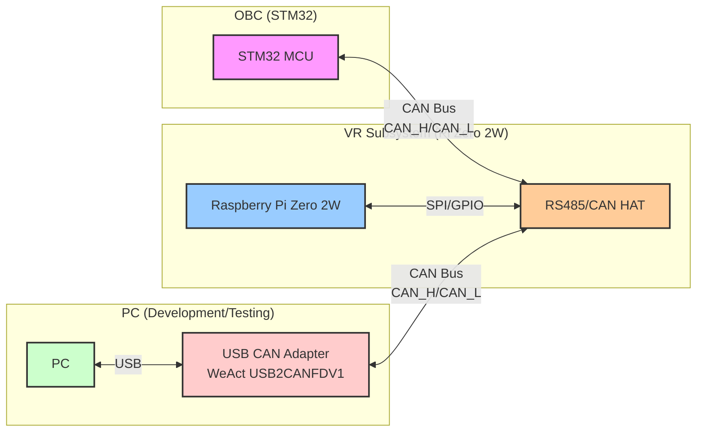
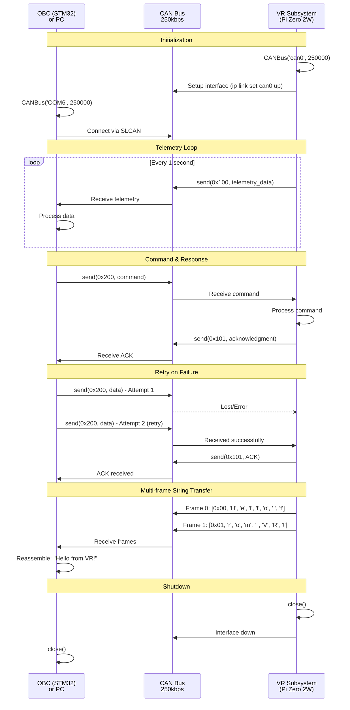
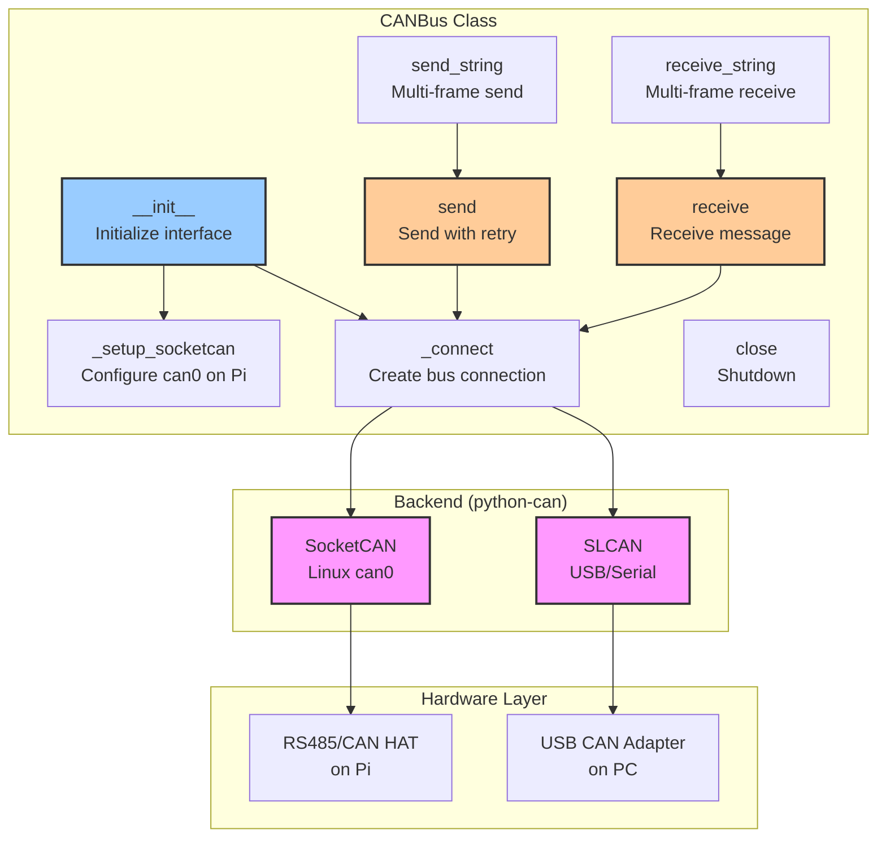

# VR CAN Bus Library

Simple and reliable CAN communication library for Raspberry Pi Zero 2W and PC.

## Features

- ✅ Works on both Pi (SocketCAN/can0) and PC (USB CAN adapter/COM port)
- ✅ Automatic retry for reliable transmission
- ✅ Send/receive raw bytes or strings
- ✅ Multi-frame support for large messages
- ✅ Simple API

## Architecture

### System Block Diagram



### Communication Sequence Diagram



### Library Component Diagram



## Installation

```bash
pip install python-can
```

## Quick Start

### On Raspberry Pi (can0)

```python
from canbus import CANBus

# Create CAN bus instance (auto-configures can0)
can = CANBus('can0', bitrate=250000)

# Send message
can.send(0x123, [0x01, 0x02, 0x03, 0x04])

# Receive message
result = can.receive(timeout=1.0)
if result:
    can_id, data = result
    print(f"Received ID: 0x{can_id:X}, Data: {data}")

# Close
can.close()
```

### On PC (USB CAN adapter)

```python
from canbus import CANBus

# Create CAN bus instance for COM port
can = CANBus('COM6', bitrate=250000)

# Send message
can.send(0x123, [0x01, 0x02, 0x03, 0x04])

# Receive message
result = can.receive(timeout=1.0)
if result:
    can_id, data = result
    print(f"Received ID: 0x{can_id:X}, Data: {data}")

# Close
can.close()
```

### Using Context Manager

```python
from canbus import CANBus

with CANBus('can0') as can:
    # Send
    can.send(0x123, [0x01, 0x02, 0x03])
    
    # Receive
    result = can.receive(timeout=2.0)
    if result:
        can_id, data = result
        print(f"Got: {data}")
# Automatically closed
```

### Send/Receive Strings

```python
from canbus import CANBus

with CANBus('can0') as can:
    # Send string (automatically split into frames)
    can.send_string(0x200, "Hello from VR subsystem!")
    
    # Receive string (automatically reassemble frames)
    text = can.receive_string(timeout=5.0)
    if text:
        print(f"Received: {text}")
```

## API Reference

### `CANBus(interface, bitrate=100000, auto_setup=True, queue_size=100)`

Create CAN bus instance.

- `interface`: 'can0' for Pi, 'COM6' (or other) for PC
- `bitrate`: CAN bitrate in bps (default: 100000)
- `auto_setup`: Auto-configure interface on Pi (default: True)
- `queue_size`: Max messages to queue when link down (default: 100, 0=unlimited)

### `send(can_id, data, extended=False, max_retries=3, queue_on_fail=True)`

Send CAN message with retry and automatic queuing on link failure.

- `can_id`: CAN ID (0x000-0x7FF standard, up to 0x1FFFFFFF extended)
- `data`: List of 0-8 bytes
- `extended`: Use extended ID format
- `max_retries`: Retry attempts
- `queue_on_fail`: Queue message if link is down (default: True)
- Returns: `True` if successful or queued

### `receive(timeout=1.0)`

Receive CAN message.

- `timeout`: Timeout in seconds (None for blocking)
- Returns: `(can_id, data)` tuple or `None` if timeout

### `send_string(can_id, text, extended=False)`

Send string as multi-frame message.

- `can_id`: CAN ID
- `text`: String to send
- Returns: `True` if successful

### `receive_string(timeout=5.0, max_frames=100)`

Receive multi-frame string message.

- `timeout`: Total timeout
- `max_frames`: Max frames to collect
- Returns: Reconstructed string or `None`

### `close()`

Close CAN connection and shutdown interface.

### `flush_buffers()`

Flush TX/RX buffers to prevent blocking. Automatically called when link appears down.

### `reset_link()`

Manually reset link state tracking. Call after fixing connection issues.

### `is_link_up()`

Check if CAN link appears to be operational.

- Returns: `True` if link is up, `False` if multiple consecutive failures detected

### `get_queue_stats()`

Get message queue statistics.

- Returns: Dictionary with `queue_length`, `total_queued`, `total_dropped`, `queue_max`

### `clear_queue()`

Clear all queued messages (use with caution!).

- Returns: Number of messages cleared

## Link Management & Message Queuing

The library automatically manages link failures and prevents data loss:

### Automatic Message Queuing
- **Queue on link down**: Messages are automatically queued when link fails (default: up to 100 messages)
- **Auto-retry on recovery**: Queued messages automatically sent when link recovers
- **No data loss**: Messages preserved during temporary link failures
- **Configurable queue size**: Adjust with `queue_size` parameter (0 = unlimited)

### Link Monitoring
- **Automatic buffer flushing**: When 5+ consecutive send failures occur, buffers are automatically flushed
- **Link state tracking**: `is_link_up()` returns `False` when link is down
- **Auto-recovery**: Link state resets automatically when successful transmission resumes
- **Non-blocking sends**: Short timeouts (0.1s) prevent receive blocking when buffer is full

### Example with Queuing

```python
from canbus import CANBus

# Create with custom queue size
can = CANBus('can0', bitrate=250000, queue_size=200)

# Send - automatically queues if link is down
can.send(0x100, [0x01, 0x02, 0x03])

# Check queue stats
stats = can.get_queue_stats()
print(f"Queued: {stats['queue_length']}, Dropped: {stats['total_dropped']}")

# Check link before critical operations
if can.is_link_up():
    print("Link is healthy")
else:
    print(f"Link down, {stats['queue_length']} messages queued")

# Manually reset link state after fixing issues
can.reset_link()  # Also drains queue
```

### Queue Behavior
- Messages queued in FIFO order (first in, first out)
- When queue is full, oldest messages are dropped
- Queue automatically drains when link recovers
- Statistics track total queued and dropped counts

## Examples

### Pi Example (VR Subsystem)

```python
from canbus import CANBus
import time

# Initialize CAN on Pi
can = CANBus('can0', bitrate=100000)

try:
    # Send telemetry to OBC
    while True:
        can.send(0x100, [0x01, 0x02, 0x03, 0x04, 0x05])
        
        # Listen for commands from OBC
        result = can.receive(timeout=0.1)
        if result:
            cmd_id, data = result
            print(f"Command from OBC: ID=0x{cmd_id:X}, Data={data}")
        
        time.sleep(0.5)
finally:
    can.close()
```

### PC Example (Testing/Development)

```python
from canbus import CANBus

# Connect to USB CAN adapter
can = CANBus('COM6', bitrate=100000)

try:
    # Send command to Pi
    can.send(0x200, [0xAA, 0xBB, 0xCC])
    print("Command sent")
    
    # Wait for response
    result = can.receive(timeout=2.0)
    if result:
        can_id, data = result
        print(f"Response: ID=0x{can_id:X}, Data={[hex(b) for b in data]}")
    else:
        print("No response")
finally:
    can.close()
```

## Testing Connection

### On Pi:
```bash
# Terminal 1: Monitor CAN traffic
candump can0

# Terminal 2: Run Python script
python3 your_script.py
```

### On PC:
Just run your Python script with the COM port configured.

## Notes

- Default bitrate is 100kbps (100000)
- Maximum 8 bytes per CAN frame
- Automatic retry on send failure (default: 3 attempts)
- String messages automatically split/reassemble across multiple frames
- First byte of multi-frame messages is sequence number

## Troubleshooting

**Pi: "Network is down"**
- Check if CAN HAT is properly connected
- Try manual setup: `sudo ip link set can0 type can bitrate 100000 && sudo ip link set can0 up`

**PC: "Cannot find COM port"**
- Verify COM port in Device Manager
- Check USB CAN adapter drivers installed
- Use correct COM port number

**No messages received**
- Check both devices use same bitrate
- Verify CAN_H and CAN_L connections
- Check termination resistors (120Ω at each end)

## License

See LICENSE file in project root.
