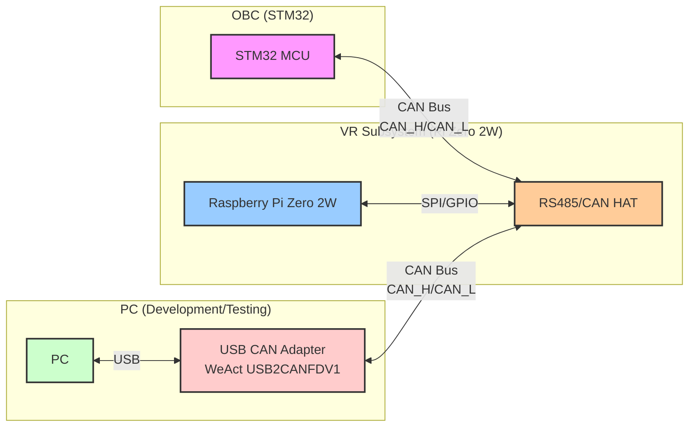
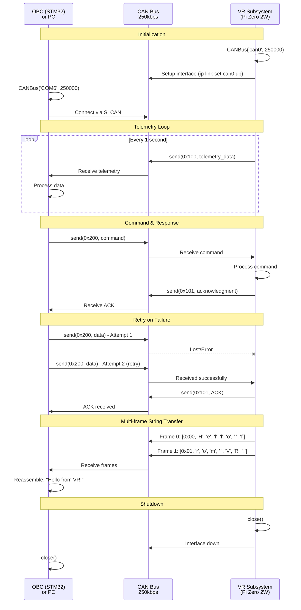
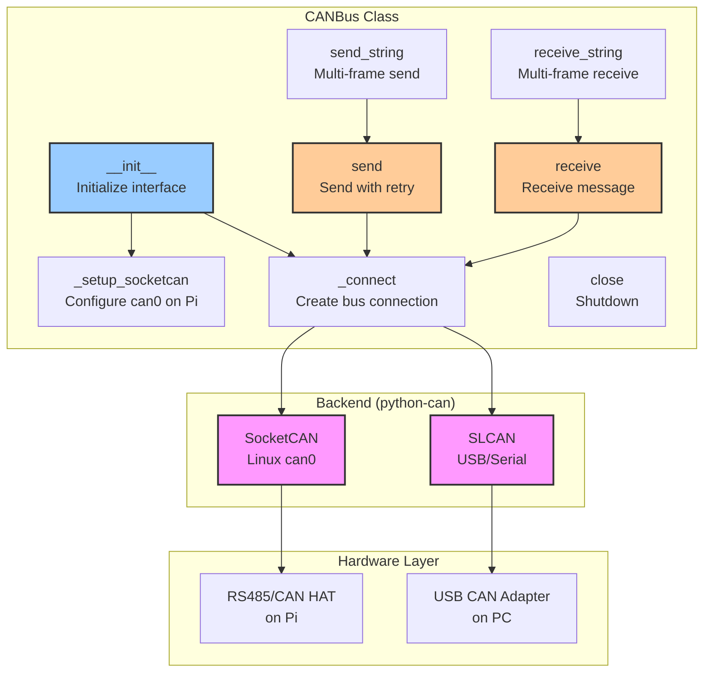

# Reliable CAN Bus Library for Satellite Systems

**KISS** (Keep It Simple, Stupid) design for Raspberry Pi Zero 2W CAN communication.

## Key Design Principles

🔹 **Zero Data Loss** - Application-level queue prevents message loss  
🔹 **Hardware Buffer Protection** - Prevents RS485 CAN HAT buffer overflow  
🔹 **Simple Link Detection** - Fast failure detection (3 failed sends)  
🔹 **Background RX Thread** - Non-blocking message reception for ACKs  
🔹 **ACK Protocol** - Application-level delivery confirmation  
🔹 **Automatic Recovery** - Drains queue when link recovers (~100 msg/sec)  
🔹 **Minimal Retries** - One send attempt only (KISS)

## The Problem We Solved

**Hardware Buffer Overflow on Pi Zero 2W:**
- When CAN link fails, the RS485 CAN HAT buffers outgoing messages
- Once hardware buffer fills up (typically ~100 messages), **the interface becomes unusable**
- System requires reboot to recover

**Our Solution:**
- Detect link failure after just 3 failed sends (~0.15s)
- **Immediately stop using hardware buffer**
- Queue messages in RAM (Python deque, 1000 messages)
- Aggressively flush hardware buffer when link fails
- Set TX queue length to 10 messages max (`txqueuelen 10`)
- Background thread continuously receives messages (500-message buffer)
- Application-level ACK protocol for guaranteed delivery

## Features

✅ Application-level message queue (RAM, not hardware)  
✅ Fast link failure detection (3 failures, ~0.15s)  
✅ Hardware buffer flushing on failure  
✅ Automatic queue draining on recovery (~100 msg/sec)  
✅ Background RX thread for non-blocking ACKs  
✅ ACK protocol for delivery confirmation  
✅ Works on Pi (SocketCAN) and PC (USB CAN)  
✅ Simple API - send(), send_with_ack(), receive(), receive_all()

## Architecture

### System Block Diagram



### Communication Sequence Diagram



### Library Component Diagram



## Installation

```bash
pip install python-can
```

## Quick Start

### On Raspberry Pi Zero 2W (can0)

```python
from canbus import CANBus

# Initialize (auto-configures can0 with txqueuelen=10)
can = CANBus('can0', bitrate=250000, queue_size=1000)

# Send message (auto-queues if link down)
can.send(0x100, [0x01, 0x02, 0x03, 0x04])

# Check link status
stats = can.get_stats()
print(f"Link: {'UP' if stats['link_up'] else 'DOWN'}, Queue: {stats['queue_length']}")

# Receive message
result = can.receive(timeout=1.0)
if result:
    can_id, data = result
    print(f"RX: ID=0x{can_id:X}, Data={data}")

can.close()
```

### On PC (USB CAN adapter)

```python
from canbus import CANBus

# Same API, different interface
can = CANBus('COM6', bitrate=250000)

# Bulk receive for efficiency
messages = can.receive_all(timeout=0.1, max_msgs=100)
for can_id, data in messages:
    print(f"RX: ID=0x{can_id:X}, Data={data}")

can.close()
```

### Production Example (Pi) - With ACK Confirmation

```python
from canbus import CANBus
import time

can = CANBus('can0', bitrate=250000, queue_size=1000)

try:
    counter = 0
    consecutive_ack_failures = 0
    
    while True:
        # Send telemetry with ACK confirmation
        telemetry = [0x01, counter & 0xFF, (counter >> 8) & 0xFF, 0xAA]
        success = can.send_with_ack(0x100, telemetry, timeout=0.5, max_retries=1)
        
        if not success:
            consecutive_ack_failures += 1
            print(f"ACK failed! Consecutive failures: {consecutive_ack_failures}")
            
            # After 3 failures, switch to queue mode
            if consecutive_ack_failures >= 3:
                print("Switching to queue mode (link appears down)")
                can._link_ok = False
                can._flush_hardware_buffer()
                consecutive_ack_failures = 0
        else:
            consecutive_ack_failures = 0
        
        # Check link every 5 seconds (drain queue if needed)
        if counter % 5 == 0:
            can.check_link()
            stats = can.get_stats()
            if stats['queue_length'] > 0:
                print(f"[WARN] {stats['queue_length']} messages queued")
        
        counter += 1
        time.sleep(1.0)
        
except KeyboardInterrupt:
    can.close()
```

### Production Example (PC) - With Automatic ACK

```python
from canbus import CANBus

can = CANBus('COM6', bitrate=250000)

try:
    while True:
        # Bulk receive (from background RX thread)
        messages = can.receive_all(timeout=0.1, max_msgs=100)
        
        for can_id, data in messages:
            print(f"RX: ID=0x{can_id:X}, Data={data}")
            
            # Send ACK (fire-and-forget, non-blocking)
            try:
                can.send_ack(can_id, data)
            except Exception:
                pass  # Don't let ACK failures stop processing
        
except KeyboardInterrupt:
    can.close()
```

## API Reference

### `CANBus(interface, bitrate=250000, auto_setup=True, queue_size=1000)`

**Parameters:**
- `interface`: `'can0'` for Pi, `'COM6'` for PC
- `bitrate`: CAN bitrate (default: 250000 bps)
- `auto_setup`: Auto-configure interface (default: True)
- `queue_size`: Max RAM queue size (default: 1000, 0=unlimited)

**What happens on init:**
1. Sets `txqueuelen=10` on can0 (limits hardware buffer)
2. Enables auto-restart on bus-off (`restart-ms 100`)
3. Creates application-level message queue in RAM (1000 messages)
4. Creates RX buffer in RAM (500 messages)
5. Starts background RX thread for continuous message reception

### `send(can_id, data, extended=False) -> bool`

**Reliable send with zero data loss guarantee.**

**Parameters:**
- `can_id`: CAN ID (0x000-0x7FF standard, 0x1FFFFFFF extended)
- `data`: List of 0-8 bytes
- `extended`: Use extended ID (default: False)

**Returns:** `True` if sent or queued, `False` only if queue full

**Behavior:**
- If link OK: Sends immediately (timeout=0.05s)
- If send fails 3 times: Marks link DOWN, flushes hardware buffer
- If link DOWN: Queues message in RAM (doesn't touch hardware)
- When link recovers: Automatically drains queue at ~100 msg/sec

### `send_with_ack(can_id, data, timeout=0.5, max_retries=1, extended=False) -> bool`

**Send with application-level ACK confirmation.**

**Parameters:**
- `can_id`: CAN ID
- `data`: List of 0-8 bytes
- `timeout`: Seconds to wait for ACK (default: 0.5)
- `max_retries`: Number of retry attempts (default: 1)
- `extended`: Use extended ID (default: False)

**Returns:** `True` if ACK received, `False` if timeout

**ACK Protocol:**
- Sends message with ID `can_id`
- Expects ACK with ID `can_id + 1`
- ACK format: `[0xFF, original_data[0]]`
- Non-blocking: Checks RX buffer (populated by background thread)

### `send_ack(can_id, data) -> bool`

**Send ACK response (for ground station).**

**Parameters:**
- `can_id`: Original message CAN ID
- `data`: Original message data

**Behavior:**
- Sends ACK with ID `can_id + 1`
- ACK data: `[0xFF, data[0]]`
- Fire-and-forget (timeout=0, non-blocking)

### `receive(timeout=1.0) -> Optional[Tuple[int, List[int]]]`

**Receive single message from RX buffer.**

**Parameters:**
- `timeout`: Timeout in seconds

**Returns:** `(can_id, data)` or `None`

**Note:** Messages are populated by background RX thread

### `receive_all(timeout=0.01, max_msgs=100) -> List[Tuple[int, List[int]]]`

Bulk receive for high throughput (from RX buffer).

**Parameters:**
- `timeout`: Timeout for first message
- `max_msgs`: Max messages per call

**Returns:** List of `(can_id, data)` tuples

**Note:** Background thread continuously fills RX buffer

### `check_link() -> bool`

Manually check link health (attempts to drain queue).

**Returns:** `True` if link is up

**Usage:** Call this periodically (every 5 seconds recommended) from your main loop for fast recovery.

### `get_stats() -> dict`

Get queue and transmission statistics.

**Returns:**
```python
{
    'link_up': bool,         # Link state
    'queue_length': int,     # Current queue size
    'queue_max': int,        # Max queue capacity
    'total_sent': int,       # Total messages sent
    'total_queued': int,     # Total messages queued
    'total_dropped': int,    # Messages dropped (queue full)
}
```

### `clear_queue() -> int`

**⚠️ WARNING: Causes data loss!**

Clear all queued messages.

**Returns:** Number of messages cleared

### `close()`

Close connection and print final statistics.

## How It Works: Hardware Buffer Protection

### The Problem
1. CAN link fails (cable disconnected, power issue, etc.)
2. Application keeps calling `send()`
3. Messages pile up in **RS485 CAN HAT hardware buffer**
4. Hardware buffer fills (typically ~100-200 messages)
5. **Interface becomes completely unusable** - even when link recovers
6. Only solution: Reboot the Pi

### Our Solution (3-Layer Defense)

#### Layer 1: Small Hardware Buffer
```python
os.system(f'sudo ip link set can0 txqueuelen 10')  # Only 10 messages max
```
Limits hardware queue to 10 messages, reducing overflow risk.

#### Layer 2: Fast Failure Detection
```python
if self._fail_count >= 3:  # After 3 failed sends
    self._link_ok = False   # Mark link DOWN
    self._flush_hardware_buffer()  # Clear hardware buffer
```
Detects failure in ~0.15 seconds (3 × 0.05s timeout).

#### Layer 3: Application Queue (RAM)
```python
self._msg_queue = deque(maxlen=queue_size)  # Store in RAM, not hardware
```
Messages queued in Python memory, **never sent to hardware when link is down**.

### Message Flow

**When Link is UP:**
```
send() → Hardware Buffer (10 max) → CAN Bus → ✓ Sent
```

**When Link is DOWN:**
```
send() → RAM Queue (1000 max) → [Waiting for recovery]
         ↓
         Hardware buffer EMPTY (flushed)
```

**When Link Recovers:**
```
check_link() → Drain RAM Queue → Hardware Buffer → CAN Bus → ✓ All sent
```

## Examples

### Pi Example (VR Subsystem)

```python
from canbus import CANBus
import time

# Initialize CAN on Pi
can = CANBus('can0', bitrate=100000)

try:
    # Send telemetry to OBC
    while True:
        can.send(0x100, [0x01, 0x02, 0x03, 0x04, 0x05])
        
        # Listen for commands from OBC
        result = can.receive(timeout=0.1)
        if result:
            cmd_id, data = result
            print(f"Command from OBC: ID=0x{cmd_id:X}, Data={data}")
        
        time.sleep(0.5)
finally:
    can.close()
```

### PC Example (Testing/Development)

```python
from canbus import CANBus
import time

# Connect to USB CAN adapter
can = CANBus('COM6', bitrate=250000)

try:
    msg_count = 0
    start_time = time.time()
    
    while True:
        # Fast receive - get all buffered messages at once
        messages = can.receive_all(timeout=0.1, max_messages=100)
        
        if messages:
            for can_id, data in messages:
                msg_count += 1
                print(f"[RX] ID=0x{can_id:X}, Data={[hex(b) for b in data]}")
            
            # Show throughput stats
            elapsed = time.time() - start_time
            if elapsed >= 1.0:
                print(f"[STATS] {msg_count} msgs in {elapsed:.2f}s = {msg_count/elapsed:.1f} msg/s")
                msg_count = 0
                start_time = time.time()
        else:
            time.sleep(0.1)
finally:
    can.close()
```

### PC Example (Simple Single Message)

```python
from canbus import CANBus

# Connect to USB CAN adapter
can = CANBus('COM6', bitrate=250000)

try:
    # Send command to Pi
    can.send(0x200, [0xAA, 0xBB, 0xCC])
    print("Command sent")
    
    # Wait for response
    result = can.receive(timeout=2.0)
    if result:
        can_id, data = result
        print(f"Response: ID=0x{can_id:X}, Data={[hex(b) for b in data]}")
    else:
        print("No response")
finally:
    can.close()
```

## Troubleshooting

### Pi: "Network is down" or interface unusable
```bash
# Reset the interface
sudo ip link set can0 down
sudo ip link set can0 type can bitrate 250000 restart-ms 100
sudo ip link set can0 txqueuelen 10
sudo ip link set can0 up
```

### Pi: Hardware buffer full (old problem - now prevented!)
**Before (Bad):**
- Messages queued in hardware
- Hardware buffer overflowed
- Interface became unusable
- Required reboot

**After (Good):**
- Messages queued in RAM
- Hardware buffer kept small (10 messages)
- Interface stays usable
- No reboot needed

### PC: "Cannot find COM port"
- Check Device Manager for COM port number
- Install CH340/CP2102 drivers if needed
- Verify USB connection

### No messages received
- **Check bitrate** - Both devices must use same bitrate (250000 recommended)
- **Check wiring** - CAN_H to CAN_H, CAN_L to CAN_L
- **Check termination** - 120Ω resistors at each end of bus
- **Check power** - Ensure CAN transceivers are powered

### Messages being dropped
```python
stats = can.get_stats()
if stats['total_dropped'] > 0:
    print(f"WARNING: {stats['total_dropped']} messages dropped!")
    print(f"Increase queue_size (currently {stats['queue_max']})")
```

## Performance Tips

### For Pi Zero 2W (Satellite)
```python
# Use larger queue for long outages
can = CANBus('can0', bitrate=250000, queue_size=5000)

# Check link periodically (every 10 seconds)
if counter % 10 == 0:
    can.check_link()
```

### For PC (Ground Station)
```python
# Use bulk receive for efficiency
messages = can.receive_all(timeout=0.1, max_msgs=100)
# Process all messages at once
```

## Architecture Diagrams

See README diagrams above for:
- System block diagram
- Communication sequence
- Component architecture

## License

See LICENSE file.
