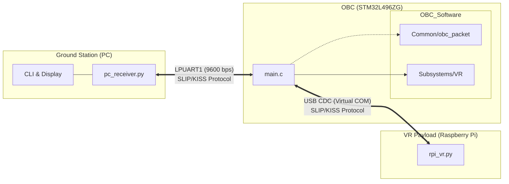

# OBC SpaceFruit Project

This project implements a satellite On-Board Computer (OBC) system that acts as a bridge and coordinator between a Ground Station (PC) and a Virtual Reality (VR) Payload (Raspberry Pi).

## System Architecture

The system consists of three main components communicating via SLIP-encoded KISS frames with CRC32 integrity checks.

## Communications Protocol

The communication stack is standardized across both links (GS-OBC and OBC-Payload):

1.  **Physical Layer**: LPUART (GS) / USB CDC (Payload)
2.  **Framing**: SLIP (RFC 1055)
3.  **Transport**: KISS (FEND/Command Byte)
4.  **Application**: Custom Binary Packets with CRC32

### Packet Structure
`[FEND] [CMD_TYPE] [PAYLOAD_ID] [DATA...] [CRC32] [FEND]`

### KISS Framing Details
The system uses the KISS protocol (similar to SLIP) to ensure data transparency on the serial link:

*   **FEND (`0xC0`)**: Frame End byte. Marks the start and end of every packet.
*   **Escaping Mechanism**:
    *   If data contains `0xC0` $\to$ it is sent as `0xDB 0xDC`.
    *   If data contains `0xDB` $\to$ it is sent as `0xDB 0xDD`.
*   **Command Byte**: The first byte after `FEND` (`[CMD_TYPE]`) defines the frame content:
    *   `0x00`: Data Frame (Commands, Image Chunks)
    *   `0x01`: Text Log Message
    *   `0x12`, `0x21`: Custom Status Responses

### CRC Integrity Check
A 32-bit Cyclic Redundancy Check (CRC32) is appended to every packet to ensure data integrity.
*   **Algorithm**: Standard CRC-32 (IEEE 802.3/Zlib).
*   **Placement**: Last 4 bytes of the payload (Little Endian).
*   **Calculation Scope**:
    *   **Uplink (PC -> OBC)**: Calculated on **[KISS Command Byte] + [Payload data]**.
    *   **Downlink (OBC -> PC)**: Calculated on **[KISS Command Byte] + [Payload data]**.

## Project Structure

*   `GroundStation/`: Python tools for the PC operator.
*   `NUCLEO_L496ZG_OBC_VR/`: C firmware for the STM32 microcontroller.
    *   `OBC_Software/`: Modular application logic.
*   `VR/`: Python simulator/driver for the Payload.
